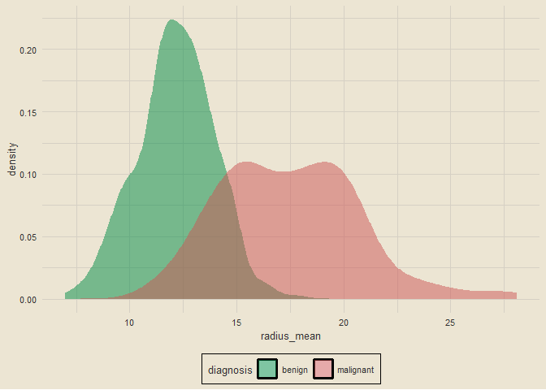

Breast Cancer Wisconsin (Diagnostic) Data Set
================

# **IN PROGRESS**

------------------------------------------------------------------------

### Setup

``` r
library(tidyverse)
library(tidymodels)
library(tvthemes)
library(janitor)
library(patchwork)

theme_custom = theme_avatar() +
  theme(plot.title = element_text(hjust = 0.5),
        panel.grid.major = element_line(linewidth = 0.5, colour = "#D6D0C4"),
        panel.grid.minor = element_line(linewidth = 0.5, colour = "#D6D0C4"))

theme_set(theme_custom)
```

### Data Import

``` r
df = clean_names(read_csv("breast_cancer_data.csv", col_types = cols()))
paste0("Data Dimensions: ", nrow(df), " Rows, ", ncol(df), " Columns")
```

    ## [1] "Data Dimensions: 569 Rows, 32 Columns"

### Checking for Missing Data

``` r
colSums(is.na(df))
```

    ##                      id               diagnosis             radius_mean 
    ##                       0                       0                       0 
    ##            texture_mean          perimeter_mean               area_mean 
    ##                       0                       0                       0 
    ##         smoothness_mean        compactness_mean          concavity_mean 
    ##                       0                       0                       0 
    ##     concave_points_mean           symmetry_mean  fractal_dimension_mean 
    ##                       0                       0                       0 
    ##               radius_se              texture_se            perimeter_se 
    ##                       0                       0                       0 
    ##                 area_se           smoothness_se          compactness_se 
    ##                       0                       0                       0 
    ##            concavity_se       concave_points_se             symmetry_se 
    ##                       0                       0                       0 
    ##    fractal_dimension_se            radius_worst           texture_worst 
    ##                       0                       0                       0 
    ##         perimeter_worst              area_worst        smoothness_worst 
    ##                       0                       0                       0 
    ##       compactness_worst         concavity_worst    concave_points_worst 
    ##                       0                       0                       0 
    ##          symmetry_worst fractal_dimension_worst 
    ##                       0                       0

None :)

### XXX

``` r
# renaming `diagnosis` labels
df = df |>
  mutate(diagnosis = ifelse(diagnosis == "M", "Malignant", "Benign"))

df |>
  count(diagnosis) |>
  ggplot(aes(diagnosis, n)) +
  geom_col(aes(fill = diagnosis), show.legend = F) +
  geom_text(aes(label = n), size = 3, vjust = -0.5) +
  scale_fill_manual(values = c("springgreen4", "indianred3")) +
  labs(x = "Diagnosis", y = "Count", title = "Diagnosis Counts") +
  theme(axis.text.y = element_blank())
```

<!-- -->
