Breast Cancer Wisconsin (Diagnostic) Data Set
================

[Kaggle
Link](https://www.kaggle.com/datasets/uciml/breast-cancer-wisconsin-data)

# **IN PROGRESS**

------------------------------------------------------------------------

### Contents

- [Setup](#setup)
- [Data Import](#data-import)
- [Checking for Missing Data](#checking-for-missing-data)
- [Exploratory Data Analysis](#exploratory-data-analysis)

### Setup

``` r
tictoc::tic()

library(tidyverse)
library(tidymodels)
library(tvthemes)
library(janitor)
library(patchwork)

theme_custom = theme_avatar() +
  theme(plot.title = element_text(hjust = 0.5),
        plot.subtitle = element_text(hjust = 0.5, size = 9, vjust = 2.5, face = "italic"),
        panel.grid.major = element_line(linewidth = 0.5, colour = "#D6D0C4"),
        panel.grid.minor = element_line(linewidth = 0.5, colour = "#D6D0C4"))

theme_set(theme_custom)
custom_fills = scale_fill_manual(values = c("springgreen4", "indianred3"))
```

### Data Import

<details>
<summary>
View Code
</summary>

``` r
df = clean_names(read_csv("breast_cancer_data.csv", col_types = cols()))
paste0("Data Dimensions: ", nrow(df), " Rows, ", ncol(df), " Columns")
```

</details>

    ## [1] "Data Dimensions: 569 Rows, 32 Columns"

### Checking for Missing Data

<details>
<summary>
View Code
</summary>

``` r
colSums(is.na(df))
```

</details>

    ##                      id               diagnosis             radius_mean 
    ##                       0                       0                       0 
    ##            texture_mean          perimeter_mean               area_mean 
    ##                       0                       0                       0 
    ##         smoothness_mean        compactness_mean          concavity_mean 
    ##                       0                       0                       0 
    ##     concave_points_mean           symmetry_mean  fractal_dimension_mean 
    ##                       0                       0                       0 
    ##               radius_se              texture_se            perimeter_se 
    ##                       0                       0                       0 
    ##                 area_se           smoothness_se          compactness_se 
    ##                       0                       0                       0 
    ##            concavity_se       concave_points_se             symmetry_se 
    ##                       0                       0                       0 
    ##    fractal_dimension_se            radius_worst           texture_worst 
    ##                       0                       0                       0 
    ##         perimeter_worst              area_worst        smoothness_worst 
    ##                       0                       0                       0 
    ##       compactness_worst         concavity_worst    concave_points_worst 
    ##                       0                       0                       0 
    ##          symmetry_worst fractal_dimension_worst 
    ##                       0                       0

None :)

### Exploratory Data Analysis

------------------------------------------------------------------------

### Overview of *diagnosis*

<details>
<summary>
View Code
</summary>

``` r
# renaming `diagnosis` labels
df2 = df |>
  mutate(diagnosis = ifelse(diagnosis == "M", "Malignant", "Benign"))

df2 |>
  count(diagnosis) |>
  ggplot(aes(diagnosis, n)) +
  geom_col(aes(fill = diagnosis), show.legend = F) +
  geom_text(aes(label = n), size = 3.5, vjust = -0.5) +
  scale_fill_manual(values = c("springgreen4", "indianred3")) +
  labs(x = "Diagnosis", y = "Count", title = "Diagnosis Counts") +
  theme(axis.text.y = element_blank())
```

</details>

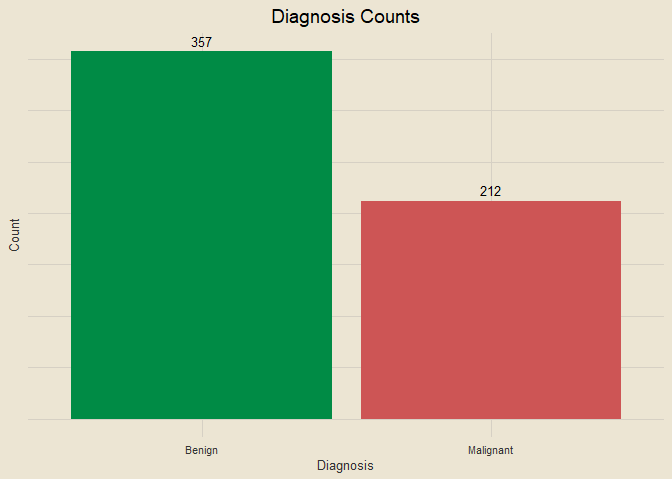<!-- -->

### Overview of *radius_mean*

<details>
<summary>
View Code
</summary>

``` r
sub_5num = function(x) {
  sub = fivenum(x)
  paste0("Min: ", sub[1], " | Q1: ", sub[2], " | Median: ", sub[3], " | Q3: ", sub[4], " | Max: ", sub[5])
}

df2 |>
  ggplot(aes(radius_mean)) +
  geom_density(aes(fill = diagnosis), alpha = 0.5, col = "transparent") +
  custom_fills +
  labs(x = "Radius Mean", y = "Density",
       title = "Distribution of Radius Mean by Diagnosis", fill = NULL,
       subtitle = sub_5num(df2$radius_mean))
```

</details>

<!-- -->

### Overview of *texture_mean*

<details>
<summary>
View Code
</summary>

``` r
df2 |>
  ggplot(aes(texture_mean)) +
  geom_density(aes(fill = diagnosis), alpha = 0.5, col = "transparent") +
  custom_fills +
  labs(x = "Texture Mean", y = "Density",
       title = "Distribution of Texture Mean by Diagnosis", fill = "Diagnosis",
       subtitle = sub_5num(df2$texture_mean))
```

</details>

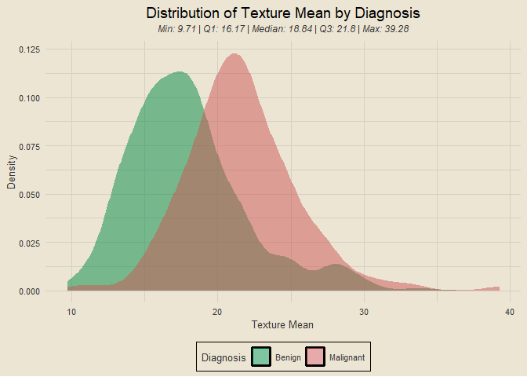<!-- -->

### Overview of *perimeter_mean*

<details>
<summary>
View Code
</summary>

``` r
df2 |>
  ggplot(aes(perimeter_mean)) +
  geom_density(aes(fill = diagnosis), alpha = 0.5, col = "transparent") +
  custom_fills +
  labs(x = "Perimeter Mean", y = "Density", fill = "Diagnosis",
       title = "Distribution of Perimeter Mean by Diagnosis",
       subtitle = sub_5num(df2$perimeter_mean))
```

</details>

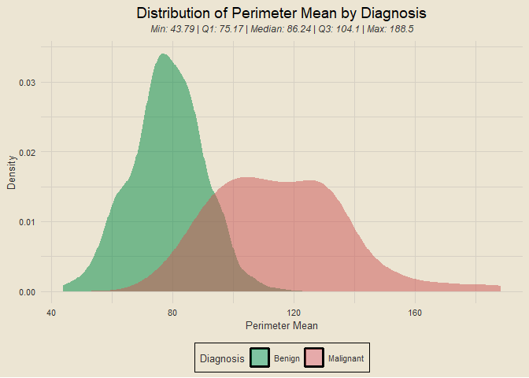<!-- -->

### Overview of *area_mean*

<details>
<summary>
View Code
</summary>

``` r
df2 |>
  ggplot(aes(area_mean)) +
  geom_density(aes(fill = diagnosis), alpha = 0.5, col = "transparent") +
  custom_fills +
  labs(x = "Area Mean", y = "Density", fill = "Diagnosis",
       title = "Distribution of Area Mean by Diagnosis",
       subtitle = sub_5num(df2$area_mean))
```

</details>

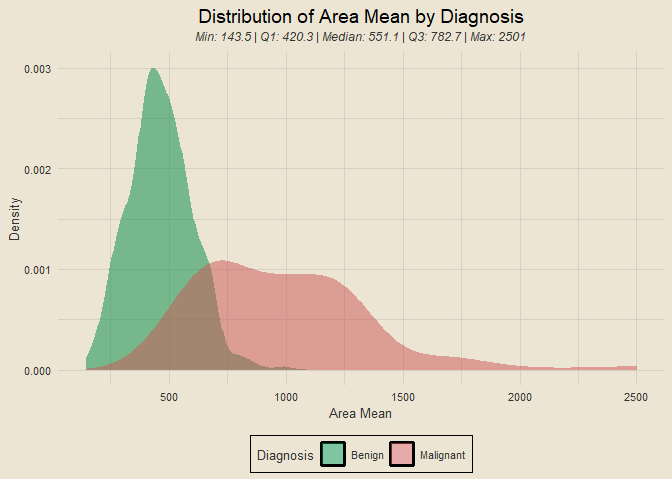<!-- -->

### Overview of *smoothness_mean*

<details>
<summary>
View Code
</summary>

``` r
df2 |>
  ggplot(aes(smoothness_mean)) +
  geom_density(aes(fill = diagnosis), alpha = 0.5, col = "transparent") +
  custom_fills +
  labs(x = "Smoothness Mean", y = "Density", fill = "Diagnosis",
       title = "Distribution of Smoothness Mean by Diagnosis",
       subtitle = sub_5num(df2$smoothness_mean))
```

</details>

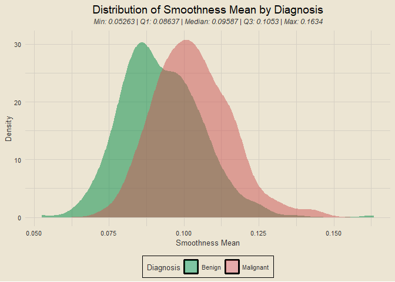<!-- -->

### Overview of *compactness_mean*

<details>
<summary>
View Code
</summary>

``` r
df2 |>
  ggplot(aes(compactness_mean)) +
  geom_density(aes(fill = diagnosis), alpha = 0.5, col = "transparent") +
  custom_fills +
  labs(x = "Compactness Mean", y = "Density", fill = "Diagnosis",
       title = "Distribution of Compactness Mean by Diagnosis",
       subtitle = sub_5num(df2$compactness_mean))
```

</details>

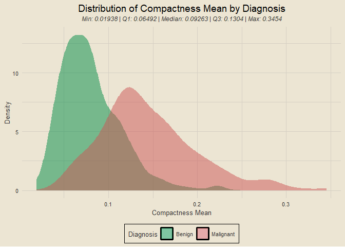<!-- -->

### Overview of *concavity_mean*

<details>
<summary>
View Code
</summary>

``` r
df2 |>
  ggplot(aes(concavity_mean)) +
  geom_density(aes(fill = diagnosis), alpha = 0.5, col = "transparent") +
  custom_fills +
  labs(x = "Concavity Mean", y = "Density", fill = "Diagnosis",
       title = "Distribution of Concavity Mean by Diagnosis",
       subtitle = sub_5num(df2$concavity_mean))
```

</details>

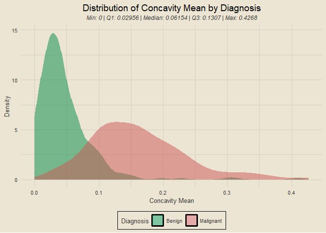<!-- -->

### Overview of *concave_points_mean*

<details>
<summary>
View Code
</summary>

``` r
df2 |>
  ggplot(aes(concave_points_mean)) +
  geom_density(aes(fill = diagnosis), alpha = 0.5, col = "transparent") +
  custom_fills +
  labs(x = "Concave Points Mean", y = "Density", fill = "Diagnosis",
       title = "Distribution of Concave Points Mean by Diagnosis",
       subtitle = sub_5num(df2$concave_points_mean))
```

</details>

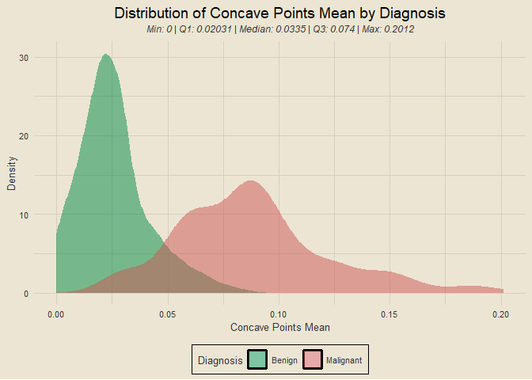<!-- -->

### Overview of *symmetry_mean*

<details>
<summary>
View Code
</summary>

``` r
df2 |>
  ggplot(aes(symmetry_mean)) +
  geom_density(aes(fill = diagnosis), alpha = 0.5, col = "transparent") +
  custom_fills +
  labs(x = "Symmetry Mean", y = "Density", fill = "Diagnosis",
       title = "Distribution of Symmetry Mean by Diagnosis",
       subtitle = sub_5num(df2$symmetry_mean))
```

</details>

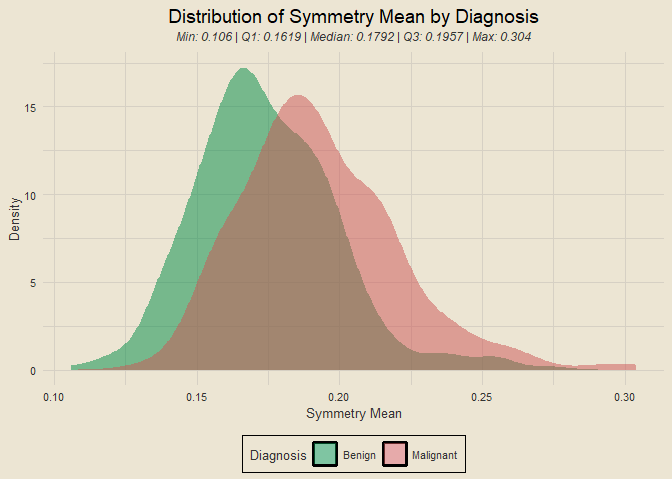<!-- -->

### Overview of *fractal_dimension_mean*

<details>
<summary>
View Code
</summary>

``` r
df2 |>
  ggplot(aes(fractal_dimension_mean)) +
  geom_density(aes(fill = diagnosis), alpha = 0.5, col = "transparent") +
  custom_fills +
  labs(x = "Fractal Dimension Mean", y = "Density", fill = "Diagnosis",
       title = "Distribution of Fractal Dimension Mean by Diagnosis",
       subtitle = sub_5num(df2$fractal_dimension_mean))
```

</details>

<!-- -->

### Overview of *radius_se*

<details>
<summary>
View Code
</summary>

``` r
df2 |>
  ggplot(aes(radius_se)) +
  geom_density(aes(fill = diagnosis), alpha = 0.5, col = "transparent") +
  custom_fills +
  labs(x = "Radius Standard Error", y = "Density", fill = "Diagnosis",
       title = "Distribution of Radius Standard Error by Diagnosis",
       subtitle = sub_5num(df2$radius_se))
```

</details>

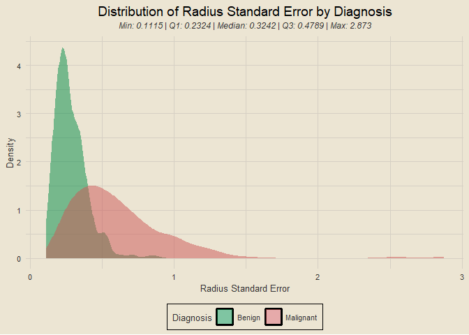<!-- -->

### Overview of *texture_se*

<details>
<summary>
View Code
</summary>

``` r
df2 |>
  ggplot(aes(texture_se)) +
  geom_density(aes(fill = diagnosis), alpha = 0.5, col = "transparent") +
  custom_fills +
  labs(x = "Texture Standard Error", y = "Density", fill = "Diagnosis",
       title = "Distribution of Texture Standard Error by Diagnosis",
       subtitle = sub_5num(df2$texture_se))
```

</details>

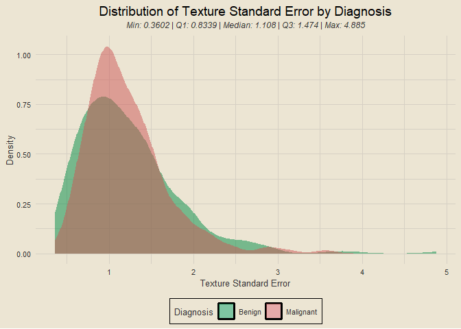<!-- -->

### Overview of *perimeter_se*

<details>
<summary>
View Code
</summary>

``` r
df2 |>
  ggplot(aes(perimeter_se)) +
  geom_density(aes(fill = diagnosis), alpha = 0.5, col = "transparent") +
  custom_fills +
  labs(x = "Perimeter Standard Error", y = "Density", fill = "Diagnosis",
       title = "Distribution of Perimeter Standard Error by Diagnosis",
       subtitle = sub_5num(df2$perimeter_se))
```

</details>

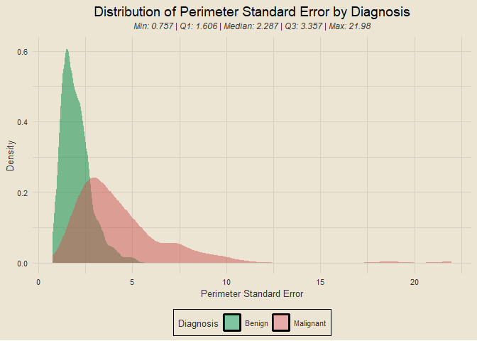<!-- -->

### Overview of *area_se*

<details>
<summary>
View Code
</summary>

``` r
df2 |>
  ggplot(aes(area_se)) +
  geom_density(aes(fill = diagnosis), alpha = 0.5, col = "transparent") +
  custom_fills +
  labs(x = "Area Standard Error", y = "Density", fill = "Diagnosis",
       title = "Distribution of Area Standard Error by Diagnosis",
       subtitle = sub_5num(df2$area_se))
```

</details>

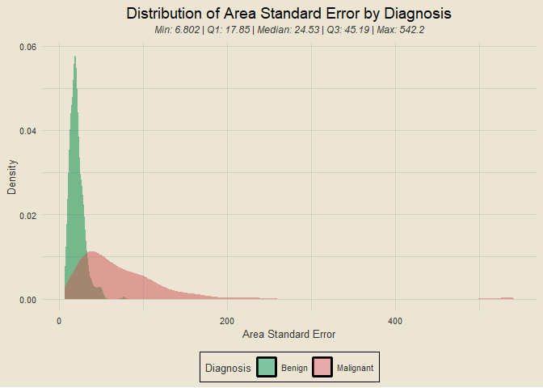<!-- -->

### Overview of *smoothness_se*

<details>
<summary>
View Code
</summary>

``` r
df2 |>
  ggplot(aes(smoothness_se)) +
  geom_density(aes(fill = diagnosis), alpha = 0.5, col = "transparent") +
  custom_fills +
  labs(x = "Smoothness Standard Error", y = "Density", fill = "Diagnosis",
       title = "Distribution of Smoothness Standard Error by Diagnosis",
       subtitle = sub_5num(df2$smoothness_se))
```

</details>

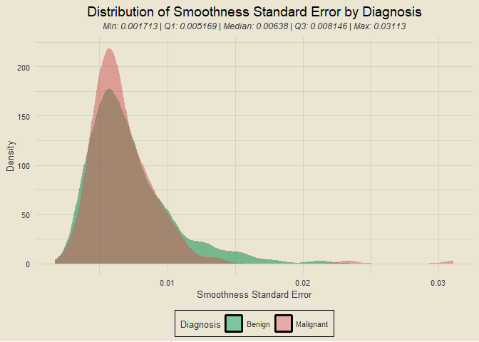<!-- -->

### Overview of *compactness_se*

<details>
<summary>
View Code
</summary>

``` r
df2 |>
  ggplot(aes(compactness_se)) +
  geom_density(aes(fill = diagnosis), alpha = 0.5, col = "transparent") +
  custom_fills +
  labs(x = "Compactness Standard Error", y = "Density", fill = "Diagnosis",
       title = "Distribution of Compactness Standard Error by Diagnosis",
       subtitle = sub_5num(df2$compactness_se))
```

</details>

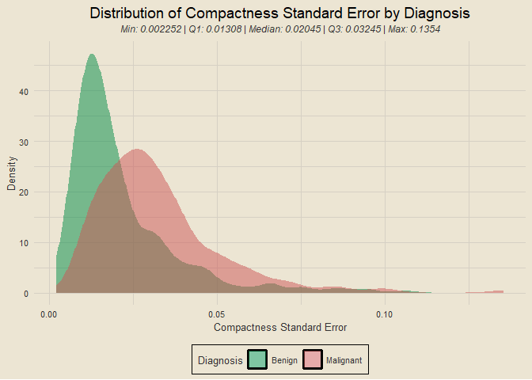<!-- -->

### Overview of *concavity_se*

<details>
<summary>
View Code
</summary>

``` r
df2 |>
  ggplot(aes(concavity_se)) +
  geom_density(aes(fill = diagnosis), alpha = 0.5, col = "transparent") +
  custom_fills +
  labs(x = "Concavity Standard Error", y = "Density", fill = "Diagnosis",
       title = "Distribution of Concavity Standard Error by Diagnosis",
       subtitle = sub_5num(df2$concavity_se))
```

</details>

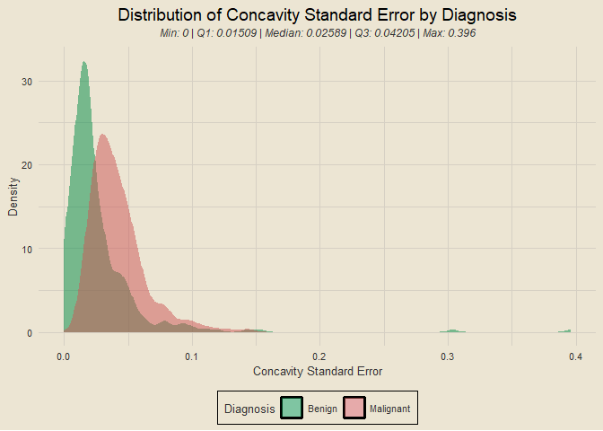<!-- -->

### Overview of *concave_points_se*

<details>
<summary>
View Code
</summary>

``` r
df2 |>
  ggplot(aes(concave_points_se)) +
  geom_density(aes(fill = diagnosis), alpha = 0.5, col = "transparent") +
  custom_fills +
  labs(x = "Concave Points Standard Error", y = "Density", fill = "Diagnosis",
       title = "Distribution of Concave Points Standard Error by Diagnosis",
       subtitle = sub_5num(df2$concave_points_se))
```

</details>

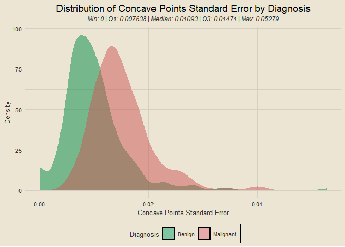<!-- -->

### Overview of *symmetry_se*

<details>
<summary>
View Code
</summary>

``` r
df2 |>
  ggplot(aes(symmetry_se)) +
  geom_density(aes(fill = diagnosis), alpha = 0.5, col = "transparent") +
  custom_fills +
  labs(x = "Symmetry Standard Error", y = "Density", fill = "Diagnosis",
       title = "Distribution of Symmetry Standard Error by Diagnosis",
       subtitle = sub_5num(df2$symmetry_se))
```

</details>

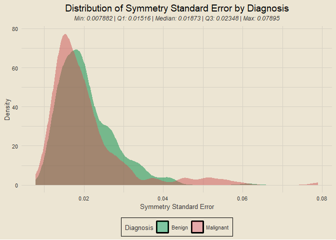<!-- -->

### Overview of *fractal_dimension_se*

<details>
<summary>
View Code
</summary>

``` r
df2 |>
  ggplot(aes(fractal_dimension_se)) +
  geom_density(aes(fill = diagnosis), alpha = 0.5, col = "transparent") +
  custom_fills +
  labs(x = "Fractal Dimension Standard Error", y = "Density", fill = "Diagnosis",
       title = "Distribution of Fractal Dimension Standard Error by Diagnosis",
       subtitle = sub_5num(df2$fractal_dimension_se))
```

</details>

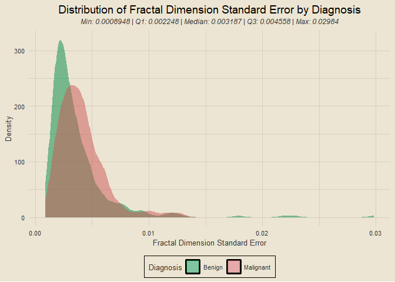<!-- -->

### *worst*-type variables placeholder

### Script Runtime

``` r
tictoc::toc()
```

    ## 9.12 sec elapsed
