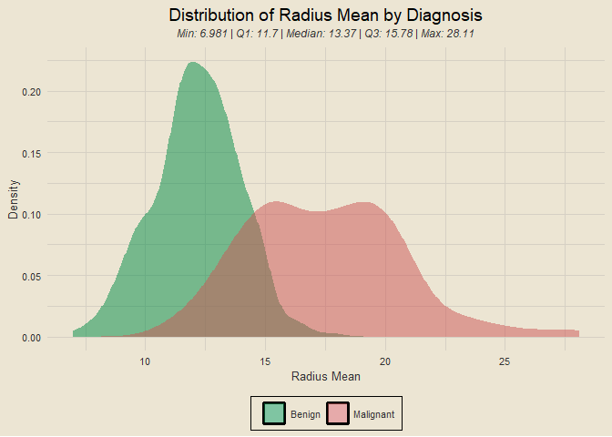
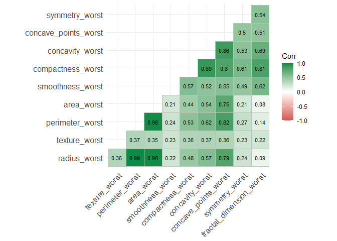
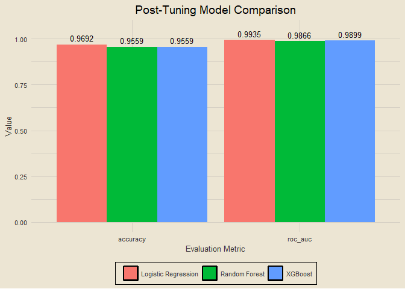

Breast Cancer Wisconsin (Diagnostic) Data Set
================

[Kaggle
Link](https://www.kaggle.com/datasets/uciml/breast-cancer-wisconsin-data)

# **IN PROGRESS**

------------------------------------------------------------------------

### Contents

- [Setup](#setup)
- [Data Import](#data-import)
- [Checking for Missing Data](#checking-for-missing-data)
- [Exploratory Data Analysis](#exploratory-data-analysis)
- [Modeling](#modeling)
- [Final Metrics](#final-metrics)
- [Script Runtime](#script-runtime)

### Setup

``` r
tictoc::tic()

library(tidyverse)
library(tidymodels)
library(tvthemes)
library(janitor)
library(patchwork)
library(ggcorrplot)
library(vip)

theme_custom = theme_avatar() +
  theme(plot.title = element_text(hjust = 0.5),
        plot.subtitle = element_text(hjust = 0.5, size = 9, vjust = 2.5, face = "italic"),
        panel.grid.major = element_line(linewidth = 0.5, colour = "#D6D0C4"),
        panel.grid.minor = element_line(linewidth = 0.5, colour = "#D6D0C4"))

theme_set(theme_custom)
custom_fills = scale_fill_manual(values = c("springgreen4", "indianred3"))
```

### Data Import

<details>
<summary>
View Code
</summary>

``` r
df = clean_names(read_csv("breast_cancer_data.csv", col_types = cols()))
paste0("Data Dimensions: ", nrow(df), " Rows, ", ncol(df), " Columns")
```

</details>

    ## [1] "Data Dimensions: 569 Rows, 32 Columns"

### Checking for Missing Data

<details>
<summary>
View Code
</summary>

``` r
colSums(is.na(df))
```

</details>

    ##                      id               diagnosis             radius_mean 
    ##                       0                       0                       0 
    ##            texture_mean          perimeter_mean               area_mean 
    ##                       0                       0                       0 
    ##         smoothness_mean        compactness_mean          concavity_mean 
    ##                       0                       0                       0 
    ##     concave_points_mean           symmetry_mean  fractal_dimension_mean 
    ##                       0                       0                       0 
    ##               radius_se              texture_se            perimeter_se 
    ##                       0                       0                       0 
    ##                 area_se           smoothness_se          compactness_se 
    ##                       0                       0                       0 
    ##            concavity_se       concave_points_se             symmetry_se 
    ##                       0                       0                       0 
    ##    fractal_dimension_se            radius_worst           texture_worst 
    ##                       0                       0                       0 
    ##         perimeter_worst              area_worst        smoothness_worst 
    ##                       0                       0                       0 
    ##       compactness_worst         concavity_worst    concave_points_worst 
    ##                       0                       0                       0 
    ##          symmetry_worst fractal_dimension_worst 
    ##                       0                       0

None :)

### Exploratory Data Analysis

------------------------------------------------------------------------

### Overview of *diagnosis*

<details>
<summary>
View Code
</summary>

``` r
# renaming `diagnosis` labels
df2 = df |>
  mutate(diagnosis = ifelse(diagnosis == "M", "Malignant", "Benign"))

df2 |>
  count(diagnosis) |>
  ggplot(aes(diagnosis, n)) +
  geom_col(aes(fill = diagnosis), show.legend = F) +
  geom_text(aes(label = n), size = 3.5, vjust = -0.5) +
  scale_fill_manual(values = c("springgreen4", "indianred3")) +
  labs(x = "Diagnosis", y = "Count", title = "Diagnosis Counts") +
  theme(axis.text.y = element_blank())
```

</details>

<!-- -->

### Overview of *radius_mean*

<details>
<summary>
View Code
</summary>

``` r
sub_5num = function(x) {
  sub = fivenum(x)
  paste0("Min: ", sub[1], " | Q1: ", sub[2], " | Median: ", sub[3], " | Q3: ", sub[4], " | Max: ", sub[5])
}

df2 |>
  ggplot(aes(radius_mean)) +
  geom_density(aes(fill = diagnosis), alpha = 0.5, col = "transparent") +
  custom_fills +
  labs(x = "Radius Mean", y = "Density",
       title = "Distribution of Radius Mean by Diagnosis", fill = NULL,
       subtitle = sub_5num(df2$radius_mean))
```

</details>

<!-- -->

### Overview of *texture_mean*

<details>
<summary>
View Code
</summary>

``` r
df2 |>
  ggplot(aes(texture_mean)) +
  geom_density(aes(fill = diagnosis), alpha = 0.5, col = "transparent") +
  custom_fills +
  labs(x = "Texture Mean", y = "Density",
       title = "Distribution of Texture Mean by Diagnosis", fill = "Diagnosis",
       subtitle = sub_5num(df2$texture_mean))
```

</details>

<!-- -->

### Overview of *perimeter_mean*

<details>
<summary>
View Code
</summary>

``` r
df2 |>
  ggplot(aes(perimeter_mean)) +
  geom_density(aes(fill = diagnosis), alpha = 0.5, col = "transparent") +
  custom_fills +
  labs(x = "Perimeter Mean", y = "Density", fill = "Diagnosis",
       title = "Distribution of Perimeter Mean by Diagnosis",
       subtitle = sub_5num(df2$perimeter_mean))
```

</details>

<!-- -->

### Overview of *area_mean*

<details>
<summary>
View Code
</summary>

``` r
df2 |>
  ggplot(aes(area_mean)) +
  geom_density(aes(fill = diagnosis), alpha = 0.5, col = "transparent") +
  custom_fills +
  labs(x = "Area Mean", y = "Density", fill = "Diagnosis",
       title = "Distribution of Area Mean by Diagnosis",
       subtitle = sub_5num(df2$area_mean))
```

</details>

<!-- -->

### Overview of *smoothness_mean*

<details>
<summary>
View Code
</summary>

``` r
df2 |>
  ggplot(aes(smoothness_mean)) +
  geom_density(aes(fill = diagnosis), alpha = 0.5, col = "transparent") +
  custom_fills +
  labs(x = "Smoothness Mean", y = "Density", fill = "Diagnosis",
       title = "Distribution of Smoothness Mean by Diagnosis",
       subtitle = sub_5num(df2$smoothness_mean))
```

</details>

<!-- -->

### Overview of *compactness_mean*

<details>
<summary>
View Code
</summary>

``` r
df2 |>
  ggplot(aes(compactness_mean)) +
  geom_density(aes(fill = diagnosis), alpha = 0.5, col = "transparent") +
  custom_fills +
  labs(x = "Compactness Mean", y = "Density", fill = "Diagnosis",
       title = "Distribution of Compactness Mean by Diagnosis",
       subtitle = sub_5num(df2$compactness_mean))
```

</details>

<!-- -->

### Overview of *concavity_mean*

<details>
<summary>
View Code
</summary>

``` r
df2 |>
  ggplot(aes(concavity_mean)) +
  geom_density(aes(fill = diagnosis), alpha = 0.5, col = "transparent") +
  custom_fills +
  labs(x = "Concavity Mean", y = "Density", fill = "Diagnosis",
       title = "Distribution of Concavity Mean by Diagnosis",
       subtitle = sub_5num(df2$concavity_mean))
```

</details>

<!-- -->

### Overview of *concave_points_mean*

<details>
<summary>
View Code
</summary>

``` r
df2 |>
  ggplot(aes(concave_points_mean)) +
  geom_density(aes(fill = diagnosis), alpha = 0.5, col = "transparent") +
  custom_fills +
  labs(x = "Concave Points Mean", y = "Density", fill = "Diagnosis",
       title = "Distribution of Concave Points Mean by Diagnosis",
       subtitle = sub_5num(df2$concave_points_mean))
```

</details>

<!-- -->

### Overview of *symmetry_mean*

<details>
<summary>
View Code
</summary>

``` r
df2 |>
  ggplot(aes(symmetry_mean)) +
  geom_density(aes(fill = diagnosis), alpha = 0.5, col = "transparent") +
  custom_fills +
  labs(x = "Symmetry Mean", y = "Density", fill = "Diagnosis",
       title = "Distribution of Symmetry Mean by Diagnosis",
       subtitle = sub_5num(df2$symmetry_mean))
```

</details>

<!-- -->

### Overview of *fractal_dimension_mean*

<details>
<summary>
View Code
</summary>

``` r
df2 |>
  ggplot(aes(fractal_dimension_mean)) +
  geom_density(aes(fill = diagnosis), alpha = 0.5, col = "transparent") +
  custom_fills +
  labs(x = "Fractal Dimension Mean", y = "Density", fill = "Diagnosis",
       title = "Distribution of Fractal Dimension Mean by Diagnosis",
       subtitle = sub_5num(df2$fractal_dimension_mean))
```

</details>

<!-- -->

### Overview of *radius_se*

<details>
<summary>
View Code
</summary>

``` r
df2 |>
  ggplot(aes(radius_se)) +
  geom_density(aes(fill = diagnosis), alpha = 0.5, col = "transparent") +
  custom_fills +
  labs(x = "Radius Standard Error", y = "Density", fill = "Diagnosis",
       title = "Distribution of Radius Standard Error by Diagnosis",
       subtitle = sub_5num(df2$radius_se))
```

</details>

<!-- -->

### Overview of *texture_se*

<details>
<summary>
View Code
</summary>

``` r
df2 |>
  ggplot(aes(texture_se)) +
  geom_density(aes(fill = diagnosis), alpha = 0.5, col = "transparent") +
  custom_fills +
  labs(x = "Texture Standard Error", y = "Density", fill = "Diagnosis",
       title = "Distribution of Texture Standard Error by Diagnosis",
       subtitle = sub_5num(df2$texture_se))
```

</details>

<!-- -->

### Overview of *perimeter_se*

<details>
<summary>
View Code
</summary>

``` r
df2 |>
  ggplot(aes(perimeter_se)) +
  geom_density(aes(fill = diagnosis), alpha = 0.5, col = "transparent") +
  custom_fills +
  labs(x = "Perimeter Standard Error", y = "Density", fill = "Diagnosis",
       title = "Distribution of Perimeter Standard Error by Diagnosis",
       subtitle = sub_5num(df2$perimeter_se))
```

</details>

<!-- -->

### Overview of *area_se*

<details>
<summary>
View Code
</summary>

``` r
df2 |>
  ggplot(aes(area_se)) +
  geom_density(aes(fill = diagnosis), alpha = 0.5, col = "transparent") +
  custom_fills +
  labs(x = "Area Standard Error", y = "Density", fill = "Diagnosis",
       title = "Distribution of Area Standard Error by Diagnosis",
       subtitle = sub_5num(df2$area_se))
```

</details>

<!-- -->

### Overview of *smoothness_se*

<details>
<summary>
View Code
</summary>

``` r
df2 |>
  ggplot(aes(smoothness_se)) +
  geom_density(aes(fill = diagnosis), alpha = 0.5, col = "transparent") +
  custom_fills +
  labs(x = "Smoothness Standard Error", y = "Density", fill = "Diagnosis",
       title = "Distribution of Smoothness Standard Error by Diagnosis",
       subtitle = sub_5num(df2$smoothness_se))
```

</details>

<!-- -->

### Overview of *compactness_se*

<details>
<summary>
View Code
</summary>

``` r
df2 |>
  ggplot(aes(compactness_se)) +
  geom_density(aes(fill = diagnosis), alpha = 0.5, col = "transparent") +
  custom_fills +
  labs(x = "Compactness Standard Error", y = "Density", fill = "Diagnosis",
       title = "Distribution of Compactness Standard Error by Diagnosis",
       subtitle = sub_5num(df2$compactness_se))
```

</details>

<!-- -->

### Overview of *concavity_se*

<details>
<summary>
View Code
</summary>

``` r
df2 |>
  ggplot(aes(concavity_se)) +
  geom_density(aes(fill = diagnosis), alpha = 0.5, col = "transparent") +
  custom_fills +
  labs(x = "Concavity Standard Error", y = "Density", fill = "Diagnosis",
       title = "Distribution of Concavity Standard Error by Diagnosis",
       subtitle = sub_5num(df2$concavity_se))
```

</details>

<!-- -->

### Overview of *concave_points_se*

<details>
<summary>
View Code
</summary>

``` r
df2 |>
  ggplot(aes(concave_points_se)) +
  geom_density(aes(fill = diagnosis), alpha = 0.5, col = "transparent") +
  custom_fills +
  labs(x = "Concave Points Standard Error", y = "Density", fill = "Diagnosis",
       title = "Distribution of Concave Points Standard Error by Diagnosis",
       subtitle = sub_5num(df2$concave_points_se))
```

</details>

<!-- -->

### Overview of *symmetry_se*

<details>
<summary>
View Code
</summary>

``` r
df2 |>
  ggplot(aes(symmetry_se)) +
  geom_density(aes(fill = diagnosis), alpha = 0.5, col = "transparent") +
  custom_fills +
  labs(x = "Symmetry Standard Error", y = "Density", fill = "Diagnosis",
       title = "Distribution of Symmetry Standard Error by Diagnosis",
       subtitle = sub_5num(df2$symmetry_se))
```

</details>

<!-- -->

### Overview of *fractal_dimension_se*

<details>
<summary>
View Code
</summary>

``` r
df2 |>
  ggplot(aes(fractal_dimension_se)) +
  geom_density(aes(fill = diagnosis), alpha = 0.5, col = "transparent") +
  custom_fills +
  labs(x = "Fractal Dimension Standard Error", y = "Density", fill = "Diagnosis",
       title = "Distribution of Fractal Dimension Standard Error by Diagnosis",
       subtitle = sub_5num(df2$fractal_dimension_se))
```

</details>

<!-- -->

### Overview of *radius_worst*

<details>
<summary>
View Code
</summary>

``` r
df2 |>
  ggplot(aes(radius_worst)) +
  geom_density(aes(fill = diagnosis), alpha = 0.5, col = "transparent") +
  custom_fills +
  labs(x = "Radius Worst", y = "Density", fill = "Diagnosis",
       title = "Distribution of Radius Worst by Diagnosis",
       subtitle = sub_5num(df2$radius_worst))
```

</details>

<!-- -->

### Overview of *texture_worst*

<details>
<summary>
View Code
</summary>

``` r
df2 |>
  ggplot(aes(texture_worst)) +
  geom_density(aes(fill = diagnosis), alpha = 0.5, col = "transparent") +
  custom_fills +
  labs(x = "Texture Worst", y = "Density", fill = "Diagnosis",
       title = "Distribution of Texture Worst by Diagnosis",
       subtitle = sub_5num(df2$texture_worst))
```

</details>

<!-- -->

### Overview of *perimeter_worst*

<details>
<summary>
View Code
</summary>

``` r
df2 |>
  ggplot(aes(perimeter_worst)) +
  geom_density(aes(fill = diagnosis), alpha = 0.5, col = "transparent") +
  custom_fills +
  labs(x = "Perimeter Worst", y = "Density", fill = "Diagnosis",
       title = "Distribution of Perimeter Worst by Diagnosis",
       subtitle = sub_5num(df2$perimeter_worst))
```

</details>

<!-- -->

### Overview of *area_worst*

<details>
<summary>
View Code
</summary>

``` r
df2 |>
  ggplot(aes(area_worst)) +
  geom_density(aes(fill = diagnosis), alpha = 0.5, col = "transparent") +
  custom_fills +
  labs(x = "Area Worst", y = "Density", fill = "Diagnosis",
       title = "Distribution of Area Worst by Diagnosis",
       subtitle = sub_5num(df2$area_worst))
```

</details>

<!-- -->

### Overview of *smoothness_worst*

<details>
<summary>
View Code
</summary>

``` r
df2 |>
  ggplot(aes(smoothness_worst)) +
  geom_density(aes(fill = diagnosis), alpha = 0.5, col = "transparent") +
  custom_fills +
  labs(x = "Smoothness Worst", y = "Density", fill = "Diagnosis",
       title = "Distribution of Smoothness Worst by Diagnosis",
       subtitle = sub_5num(df2$smoothness_worst))
```

</details>

<!-- -->

### Overview of *compactness_worst*

<details>
<summary>
View Code
</summary>

``` r
df2 |>
  ggplot(aes(compactness_worst)) +
  geom_density(aes(fill = diagnosis), alpha = 0.5, col = "transparent") +
  custom_fills +
  labs(x = "Compactness Worst", y = "Density", fill = "Diagnosis",
       title = "Distribution of Compactness Worst by Diagnosis",
       subtitle = sub_5num(df2$compactness_worst))
```

</details>

<!-- -->

### Overview of *concavity_worst*

<details>
<summary>
View Code
</summary>

``` r
df2 |>
  ggplot(aes(concavity_worst)) +
  geom_density(aes(fill = diagnosis), alpha = 0.5, col = "transparent") +
  custom_fills +
  labs(x = "Concavity Worst", y = "Density", fill = "Diagnosis",
       title = "Distribution of Concavity Worst by Diagnosis",
       subtitle = sub_5num(df2$concavity_worst))
```

</details>

<!-- -->

### Overview of *concave_points_worst*

<details>
<summary>
View Code
</summary>

``` r
df2 |>
  ggplot(aes(concave_points_worst)) +
  geom_density(aes(fill = diagnosis), alpha = 0.5, col = "transparent") +
  custom_fills +
  labs(x = "Concave Points Worst", y = "Density", fill = "Diagnosis",
       title = "Distribution of Concave Points Worst by Diagnosis",
       subtitle = sub_5num(df2$concave_points_worst))
```

</details>

<!-- -->

### Overview of *symmetry_worst*

<details>
<summary>
View Code
</summary>

``` r
df2 |>
  ggplot(aes(symmetry_worst)) +
  geom_density(aes(fill = diagnosis), alpha = 0.5, col = "transparent") +
  custom_fills +
  labs(x = "Symmetry Worst", y = "Density", fill = "Diagnosis",
       title = "Distribution of Symmetry Worst by Diagnosis",
       subtitle = sub_5num(df2$symmetry_worst))
```

</details>

<!-- -->

### Overview of *fractal_dimension_worst*

<details>
<summary>
View Code
</summary>

``` r
df2 |>
  ggplot(aes(fractal_dimension_worst)) +
  geom_density(aes(fill = diagnosis), alpha = 0.5, col = "transparent") +
  custom_fills +
  labs(x = "Fractal Dimension Worst", y = "Density", fill = "Diagnosis",
       title = "Distribution of Fractal Dimension Worst by Diagnosis",
       subtitle = sub_5num(df2$fractal_dimension_worst))
```

</details>

<!-- -->

### Correlation Plot for All *mean* Variables

<details>
<summary>
View Code
</summary>

``` r
df2 |>
  select(contains("mean")) |>
  cor() |>
  ggcorrplot(lab = T, type = "lower", lab_size = 3,
             colors = c("indianred3", "white", "springgreen4"))
```

</details>

<!-- -->

### Correlation Plot for All *se* Variables

<details>
<summary>
View Code
</summary>

``` r
df2 |>
  select(contains("se")) |>
  cor() |>
  ggcorrplot(lab = T, type = "lower", lab_size = 3,
             colors = c("indianred3", "white", "springgreen4"))
```

</details>

<!-- -->

### Correlation Plot for All *worst* Variables

<details>
<summary>
View Code
</summary>

``` r
df2 |>
  select(contains("worst")) |>
  cor() |>
  ggcorrplot(lab = T, type = "lower", lab_size = 3,
             colors = c("indianred3", "white", "springgreen4"))
```

</details>

<!-- -->

This will conclude the exploratory portion of the analysis, and I will
now move onto the modeling portion.

### Modeling

------------------------------------------------------------------------

### Data Splitting

<details>
<summary>
View Code
</summary>

``` r
data_split = initial_split(df2, prop = 0.8, strata = diagnosis)
train_data = training(data_split)
test_data = testing(data_split)
paste0("Training Data: ", nrow(train_data), " Observations; Testing Data: ", nrow(test_data), " Observations")
```

</details>

    ## [1] "Training Data: 454 Observations; Testing Data: 115 Observations"

### Examining Distribution of *diagnosis* Across Data Splits

<details>
<summary>
View Code
</summary>

``` r
train_data |>
  count(diagnosis) |>
  mutate(set = "Training Data",
         pct = round(n / sum(n), 3),
         pct_lab = paste0(pct * 100, "%")) |>
  bind_rows(test_data |>
              count(diagnosis) |>
              mutate(set = "Testing Data",
                     pct = round(n / sum(n), 3),
                     pct_lab = paste0(pct * 100, "%"))) |>
  mutate(set = factor(set, levels = c("Training Data", "Testing Data"))) |>
  ggplot(aes(set, pct)) +
  geom_col(aes(fill = diagnosis), position = "dodge") +
  geom_text(aes(label = pct_lab), position = position_dodge2(width = 1), vjust = -0.5, size = 3.5) +
  coord_cartesian(ylim = c(0, 0.65)) +
  scale_fill_manual(values = c("springgreen4", "indianred3")) +
  labs(x = "Dataset", y = "Percent of Observations", fill = NULL,
       title = "Proportional Diagnoses Across Training and Testing Data") +
  theme(legend.position = "right")
```

</details>

<!-- -->

### Data Preprocessing

<details>
<summary>
View Code
</summary>

``` r
pre_rec = recipe(diagnosis ~ ., data = df2) |>
  update_role(id, new_role = "ID") |>
  # normalizes predictors
  step_normalize(all_predictors()) |>
  # removes predictors with zero variance
  step_zv(all_predictors()) |>
  # removes highly-correlated predictors, we can control the threshold at which they are removed
  step_corr(all_predictors(), threshold = 0.9, method = "spearman")

pre_rec
```

</details>

    ## 

    ## ── Recipe ──────────────────────────────────────────────────────────────────────

    ## 

    ## ── Inputs

    ## Number of variables by role

    ## outcome:    1
    ## predictor: 30
    ## ID:         1

    ## 

    ## ── Operations

    ## • Centering and scaling for: all_predictors()

    ## • Zero variance filter on: all_predictors()

    ## • Correlation filter on: all_predictors()

### Previewing Preprocessed Data

<details>
<summary>
View Code
</summary>

``` r
pre_rec |>
  prep() |>
  juice() |>
  sample_n(10)
```

</details>

    ## # A tibble: 10 × 20
    ##          id texture_…¹ area_…² smooth…³ conca…⁴ symme…⁵ fract…⁶ radiu…⁷ textur…⁸
    ##       <dbl>      <dbl>   <dbl>    <dbl>   <dbl>   <dbl>   <dbl>   <dbl>    <dbl>
    ##  1   868682     -0.907 -0.725   0.00211 -0.520   -0.283  -0.587  -0.827 -4.04e-1
    ##  2   869254     -1.00  -0.851  -1.31    -1.06    -1.51   -0.838  -0.551  4.01e-2
    ##  3  8712853     -0.544  0.0881  0.156   -0.286   -0.115  -0.892  -0.483  2.66e-4
    ##  4   925311      2.34  -0.764  -1.56    -1.26    -2.74   -1.10   -0.328  4.86e+0
    ##  5   911654      0.288 -0.104  -0.501   -0.473   -1.11   -0.383  -0.207 -3.60e-1
    ##  6   859575      0.470  1.35   -0.446    0.788   -0.838  -1.16    1.38  -7.60e-1
    ##  7   905190      0.484 -0.399  -1.48    -0.780   -0.845  -0.235   0.339  1.05e+0
    ##  8   877486      0.744  1.40   -0.791    0.485   -0.163  -1.06    0.110 -2.61e-1
    ##  9 88143502     -1.35  -0.0389  0.192   -0.0745   0.961  -1.18    0.421 -7.34e-1
    ## 10  8911670      0.161  1.27   -0.507    0.245   -0.954  -1.82   -0.277 -7.05e-1
    ## # … with 11 more variables: smoothness_se <dbl>, compactness_se <dbl>,
    ## #   concavity_se <dbl>, concave_points_se <dbl>, symmetry_se <dbl>,
    ## #   fractal_dimension_se <dbl>, smoothness_worst <dbl>,
    ## #   compactness_worst <dbl>, symmetry_worst <dbl>,
    ## #   fractal_dimension_worst <dbl>, diagnosis <fct>, and abbreviated variable
    ## #   names ¹​texture_mean, ²​area_mean, ³​smoothness_mean, ⁴​concave_points_mean,
    ## #   ⁵​symmetry_mean, ⁶​fractal_dimension_mean, ⁷​radius_se, ⁸​texture_se

### Building Cross Validation Folds

<details>
<summary>
View Code
</summary>

``` r
cv_folds = vfold_cv(train_data, v = 5, strata = diagnosis)
cv_folds
```

</details>

    ## #  5-fold cross-validation using stratification 
    ## # A tibble: 5 × 2
    ##   splits           id   
    ##   <list>           <chr>
    ## 1 <split [363/91]> Fold1
    ## 2 <split [363/91]> Fold2
    ## 3 <split [363/91]> Fold3
    ## 4 <split [363/91]> Fold4
    ## 5 <split [364/90]> Fold5

### Building Logistic Regression Specification and Workflow

<details>
<summary>
View Code
</summary>

``` r
log_spec = logistic_reg() |>
  set_engine("glm") |>
  set_mode("classification")

log_wflow = workflow() |>
  add_recipe(pre_rec) |>
  add_model(log_spec)

log_wflow
```

</details>

    ## ══ Workflow ════════════════════════════════════════════════════════════════════
    ## Preprocessor: Recipe
    ## Model: logistic_reg()
    ## 
    ## ── Preprocessor ────────────────────────────────────────────────────────────────
    ## 3 Recipe Steps
    ## 
    ## • step_normalize()
    ## • step_zv()
    ## • step_corr()
    ## 
    ## ── Model ───────────────────────────────────────────────────────────────────────
    ## Logistic Regression Model Specification (classification)
    ## 
    ## Computational engine: glm

### Getting Logistic Regression Results

<details>
<summary>
View Code
</summary>

``` r
log_res = log_wflow |>
  fit_resamples(resamples = cv_folds,
                metrics = metric_set(accuracy, f_meas, roc_auc),
                control = control_resamples(save_pred = T))

log_res |>
  collect_metrics() |>
  select(.metric, mean, std_err)
```

</details>

    ## # A tibble: 3 × 3
    ##   .metric   mean std_err
    ##   <chr>    <dbl>   <dbl>
    ## 1 accuracy 0.969 0.0101 
    ## 2 f_meas   0.975 0.00802
    ## 3 roc_auc  0.994 0.00257

### Building Random Forest Specification and Workflow

<details>
<summary>
View Code
</summary>

``` r
rf_spec = rand_forest() |>
  set_engine("ranger", importance = "impurity") |>
  set_mode("classification")

rf_wflow = workflow() |>
  add_recipe(pre_rec) |>
  add_model(rf_spec)

rf_wflow
```

</details>

    ## ══ Workflow ════════════════════════════════════════════════════════════════════
    ## Preprocessor: Recipe
    ## Model: rand_forest()
    ## 
    ## ── Preprocessor ────────────────────────────────────────────────────────────────
    ## 3 Recipe Steps
    ## 
    ## • step_normalize()
    ## • step_zv()
    ## • step_corr()
    ## 
    ## ── Model ───────────────────────────────────────────────────────────────────────
    ## Random Forest Model Specification (classification)
    ## 
    ## Engine-Specific Arguments:
    ##   importance = impurity
    ## 
    ## Computational engine: ranger

### Getting Random Forest Results

<details>
<summary>
View Code
</summary>

``` r
rf_res = rf_wflow |>
  fit_resamples(resamples = cv_folds,
                metrics = metric_set(accuracy, f_meas, roc_auc),
                control = control_resamples(save_pred = T))

rf_res |>
  collect_metrics() |>
  select(.metric, mean, std_err)
```

</details>

    ## # A tibble: 3 × 3
    ##   .metric   mean std_err
    ##   <chr>    <dbl>   <dbl>
    ## 1 accuracy 0.954 0.0122 
    ## 2 f_meas   0.964 0.00956
    ## 3 roc_auc  0.986 0.00757

### Building XGBoost Specification and Workflow

<details>
<summary>
View Code
</summary>

``` r
xgb_spec = boost_tree() |>
  set_engine("xgboost") |>
  set_mode("classification")

xgb_wflow = workflow() |>
  add_recipe(pre_rec) |>
  add_model(xgb_spec)

xgb_wflow
```

</details>

    ## ══ Workflow ════════════════════════════════════════════════════════════════════
    ## Preprocessor: Recipe
    ## Model: boost_tree()
    ## 
    ## ── Preprocessor ────────────────────────────────────────────────────────────────
    ## 3 Recipe Steps
    ## 
    ## • step_normalize()
    ## • step_zv()
    ## • step_corr()
    ## 
    ## ── Model ───────────────────────────────────────────────────────────────────────
    ## Boosted Tree Model Specification (classification)
    ## 
    ## Computational engine: xgboost

### Getting XGBoost Results

<details>
<summary>
View Code
</summary>

``` r
xgb_res = xgb_wflow |>
  fit_resamples(resamples = cv_folds,
                metrics = metric_set(accuracy, f_meas, roc_auc),
                control = control_resamples(save_pred = T))

xgb_res |>
  collect_metrics() |>
  select(.metric, mean, std_err)
```

</details>

    ## # A tibble: 3 × 3
    ##   .metric   mean std_err
    ##   <chr>    <dbl>   <dbl>
    ## 1 accuracy 0.949 0.0108 
    ## 2 f_meas   0.960 0.00857
    ## 3 roc_auc  0.982 0.00789

### Comparing Model Results

<details>
<summary>
View Code
</summary>

``` r
three_mod_res = log_res |>
  collect_metrics() |>
  select(.metric, mean, std_err) |>
  mutate(model = "Logistic Regression") |>
  bind_rows(rf_res |>
              collect_metrics() |>
              select(.metric, mean, std_err) |>
              mutate(model = "Random Forest")) |>
  bind_rows(xgb_res |>
              collect_metrics() |>
              select(.metric, mean, std_err) |>
              mutate(model = "XGBoost"))

lr_res = three_mod_res |>
  filter(model == "Logistic Regression") |>
  mutate(mean = paste0(round(mean, 4) * 100, "%"))

lr_acc = lr_res$mean[1]
lr_f1 = lr_res$mean[2]
lr_roc = lr_res$mean[3]

three_mod_res |>
  ggplot(aes(.metric, mean)) +
  geom_col(aes(fill = model), position = "dodge") +
  geom_text(aes(label = round(mean, 4)), size = 3.5, position = position_dodge2(width = 0.9), vjust = -0.5) +
  coord_cartesian(ylim = c(0.9, 1)) +
  labs(x = "Evaluation Metric", y = "Value", fill = NULL,
       title = "Evaluation Metrics Across Models")
```

</details>

<!-- -->

After this initial modeling step, we have achieved an accuracy of
96.92%, an F1 score of 97.55%, and an AUC value of 99.35% with a
logistic regression model. We have achieved similar results with our
random forest and XGBoost models as well, and will now tune the
hyperparameters for those models to see if we can improve upon our
current results.

### Random Forest Tuning

<details>
<summary>
View Code
</summary>

``` r
tune_spec = rand_forest(trees = 1000, mtry = tune(), min_n = tune()) |>
  set_mode("classification") |>
  set_engine("ranger")

tune_wf = workflow() |>
  add_recipe(pre_rec) |>
  add_model(tune_spec)

doParallel::registerDoParallel()
tune_res = tune_grid(tune_wf, resamples = cv_folds, grid = 25)
```

</details>

    ## i Creating pre-processing data to finalize unknown parameter: mtry

<details>
<summary>
View Code
</summary>

``` r
tune_res |>
  show_best("accuracy")
```

</details>

    ## # A tibble: 5 × 8
    ##    mtry min_n .metric  .estimator  mean     n std_err .config              
    ##   <int> <int> <chr>    <chr>      <dbl> <int>   <dbl> <chr>                
    ## 1     5     3 accuracy binary     0.956     5  0.0125 Preprocessor1_Model05
    ## 2     4     9 accuracy binary     0.956     5  0.0125 Preprocessor1_Model25
    ## 3     2    17 accuracy binary     0.956     5  0.0120 Preprocessor1_Model04
    ## 4     2    29 accuracy binary     0.954     5  0.0145 Preprocessor1_Model08
    ## 5     3    25 accuracy binary     0.952     5  0.0108 Preprocessor1_Model12

### XGBoost Tuning

<details>
<summary>
View Code
</summary>

``` r
xgb_spec = boost_tree(trees = 1000, tree_depth = tune(), min_n = tune(),
                      loss_reduction = tune(), sample_size = tune(),
                      mtry = tune(), learn_rate = tune()) |>
  set_engine("xgboost") |>
  set_mode("classification")

xgb_grid = grid_latin_hypercube(tree_depth(), min_n(), loss_reduction(),
                                sample_size = sample_prop(), finalize(mtry(), train_data),
                                learn_rate(), size = 30)

xgb_wf = workflow() |>
  add_recipe(pre_rec) |>
  add_model(xgb_spec)

doParallel::registerDoParallel()
xgb_res = tune_grid(xgb_wf, resamples = cv_folds, grid = xgb_grid, control = control_grid(save_pred = T))

xgb_res |>
  show_best("roc_auc")
```

</details>

    ## # A tibble: 5 × 12
    ##    mtry min_n tree_depth learn_rate loss_r…¹ sampl…² .metric .esti…³  mean     n
    ##   <int> <int>      <int>      <dbl>    <dbl>   <dbl> <chr>   <chr>   <dbl> <int>
    ## 1    28     8         15  0.0745    7.18e- 4   0.861 roc_auc binary  0.990     5
    ## 2     5     3          8  0.00581   2.62e-10   0.529 roc_auc binary  0.989     5
    ## 3    25     5          8  0.0238    5.00e- 8   0.300 roc_auc binary  0.985     5
    ## 4    15    13          9  0.0000187 4.27e- 8   0.919 roc_auc binary  0.984     5
    ## 5    23     6          4  0.00674   2.16e- 1   0.345 roc_auc binary  0.984     5
    ## # … with 2 more variables: std_err <dbl>, .config <chr>, and abbreviated
    ## #   variable names ¹​loss_reduction, ²​sample_size, ³​.estimator

### Post-Tuning Model Comparison

<details>
<summary>
View Code
</summary>

``` r
lr_acc = collect_metrics(log_res) |>
  filter(.metric == "accuracy") |>
  pull(mean) |>
  round(4)

lr_auc = collect_metrics(log_res) |>
  filter(.metric == "roc_auc") |>
  pull(mean) |>
  round(4)

rf_acc = show_best(tune_res, metric = "accuracy", n = 1) |>
  pull(mean) |>
  round(4)

rf_auc = show_best(tune_res, metric = "roc_auc", n = 1) |>
  pull(mean) |>
  round(4)

xgb_acc = show_best(xgb_res, metric = "accuracy", n = 1) |>
  pull(mean) |>
  round(4)

xgb_auc = show_best(xgb_res, metric = "roc_auc", n = 1) |>
  pull(mean) |>
  round(4)

data.frame(model = c("Logistic Regression", "Random Forest", "XGBoost"),
           accuracy = c(lr_acc, rf_acc, xgb_acc),
           roc_auc = c(lr_auc, rf_auc, xgb_auc)) |>
  pivot_longer(!model, names_to = "metric", values_to = "value") |>
  ggplot(aes(metric, value)) +
  geom_col(aes(fill = model), position = "dodge") +
  geom_text(aes(label = value), position = position_dodge2(width = 0.9), vjust = -0.5, size = 3.5) +
  labs(title = "Post-Tuning Model Comparison", fill = NULL, x = "Evaluation Metric", y = "Value") +
  coord_cartesian(ylim = c(0, 1.05))
```

</details>

<!-- -->

After model tuning, it looks like the best model is either our logistic
regression or random forest. The logistic regression tends to have a
higher accuracy, but the random forest tends to have a larger area under
the curve. I’ll choose to move forward with the random forest.

### Finalizing Model

<details>
<summary>
View Code
</summary>

``` r
best_auc = select_best(tune_res, metric = "roc_auc")
final_rf = finalize_model(tune_spec, best_auc)
final_rf
```

</details>

    ## Random Forest Model Specification (classification)
    ## 
    ## Main Arguments:
    ##   mtry = 4
    ##   trees = 1000
    ##   min_n = 9
    ## 
    ## Computational engine: ranger

### Fitting Final Model and Getting Variable Importance

<details>
<summary>
View Code
</summary>

``` r
final_rf |>
  set_engine("ranger", importance = "permutation") |>
  fit(diagnosis ~ ., data = juice(prep(pre_rec)) |> select(-id)) |>
  vip(geom = "point")
```

</details>

<!-- -->

### Final Metrics

<details>
<summary>
View Code
</summary>

``` r
final_wf = workflow() |>
  add_recipe(pre_rec) |>
  add_model(final_rf)

final_res = final_wf |>
  last_fit(data_split)

final_res |>
  collect_metrics()
```

</details>

    ## # A tibble: 2 × 4
    ##   .metric  .estimator .estimate .config             
    ##   <chr>    <chr>          <dbl> <chr>               
    ## 1 accuracy binary         0.939 Preprocessor1_Model1
    ## 2 roc_auc  binary         0.987 Preprocessor1_Model1

### Script Runtime

``` r
tictoc::toc()
```

    ## 143.21 sec elapsed
