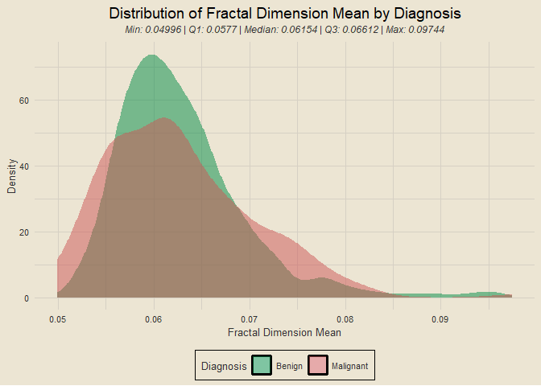
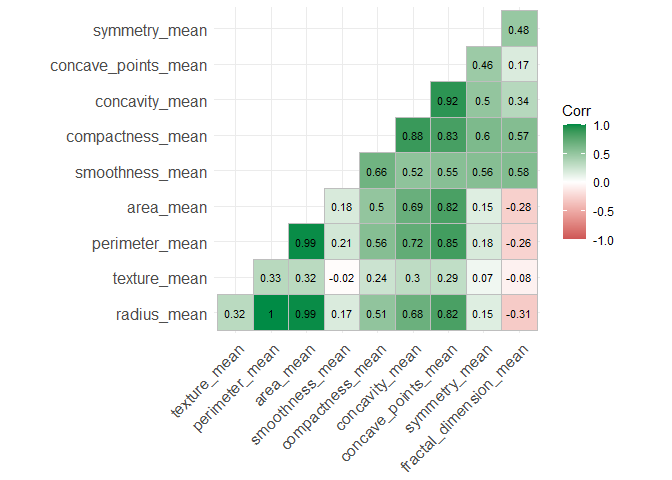
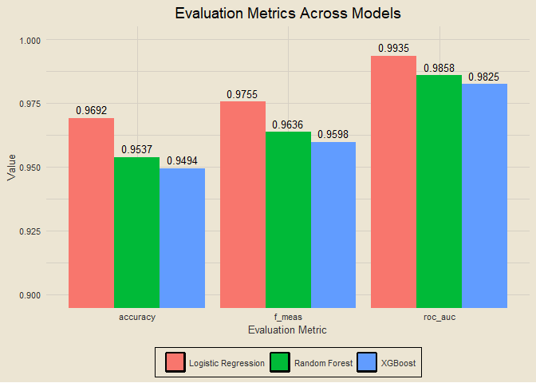

Breast Cancer Wisconsin (Diagnostic) Data Set
================

[Kaggle
Link](https://www.kaggle.com/datasets/uciml/breast-cancer-wisconsin-data)

# **IN PROGRESS**

------------------------------------------------------------------------

### Contents

- [Setup](#setup)
- [Data Import](#data-import)
- [Checking for Missing Data](#checking-for-missing-data)
- [Exploratory Data Analysis](#exploratory-data-analysis)
- [Modeling](#modeling)

### Setup

``` r
tictoc::tic()

library(tidyverse)
library(tidymodels)
library(tvthemes)
library(janitor)
library(patchwork)
library(ggcorrplot)

theme_custom = theme_avatar() +
  theme(plot.title = element_text(hjust = 0.5),
        plot.subtitle = element_text(hjust = 0.5, size = 9, vjust = 2.5, face = "italic"),
        panel.grid.major = element_line(linewidth = 0.5, colour = "#D6D0C4"),
        panel.grid.minor = element_line(linewidth = 0.5, colour = "#D6D0C4"))

theme_set(theme_custom)
custom_fills = scale_fill_manual(values = c("springgreen4", "indianred3"))
```

### Data Import

<details>
<summary>
View Code
</summary>

``` r
df = clean_names(read_csv("breast_cancer_data.csv", col_types = cols()))
paste0("Data Dimensions: ", nrow(df), " Rows, ", ncol(df), " Columns")
```

</details>

    ## [1] "Data Dimensions: 569 Rows, 32 Columns"

### Checking for Missing Data

<details>
<summary>
View Code
</summary>

``` r
colSums(is.na(df))
```

</details>

    ##                      id               diagnosis             radius_mean 
    ##                       0                       0                       0 
    ##            texture_mean          perimeter_mean               area_mean 
    ##                       0                       0                       0 
    ##         smoothness_mean        compactness_mean          concavity_mean 
    ##                       0                       0                       0 
    ##     concave_points_mean           symmetry_mean  fractal_dimension_mean 
    ##                       0                       0                       0 
    ##               radius_se              texture_se            perimeter_se 
    ##                       0                       0                       0 
    ##                 area_se           smoothness_se          compactness_se 
    ##                       0                       0                       0 
    ##            concavity_se       concave_points_se             symmetry_se 
    ##                       0                       0                       0 
    ##    fractal_dimension_se            radius_worst           texture_worst 
    ##                       0                       0                       0 
    ##         perimeter_worst              area_worst        smoothness_worst 
    ##                       0                       0                       0 
    ##       compactness_worst         concavity_worst    concave_points_worst 
    ##                       0                       0                       0 
    ##          symmetry_worst fractal_dimension_worst 
    ##                       0                       0

None :)

### Exploratory Data Analysis

------------------------------------------------------------------------

### Overview of *diagnosis*

<details>
<summary>
View Code
</summary>

``` r
# renaming `diagnosis` labels
df2 = df |>
  mutate(diagnosis = ifelse(diagnosis == "M", "Malignant", "Benign"))

df2 |>
  count(diagnosis) |>
  ggplot(aes(diagnosis, n)) +
  geom_col(aes(fill = diagnosis), show.legend = F) +
  geom_text(aes(label = n), size = 3.5, vjust = -0.5) +
  scale_fill_manual(values = c("springgreen4", "indianred3")) +
  labs(x = "Diagnosis", y = "Count", title = "Diagnosis Counts") +
  theme(axis.text.y = element_blank())
```

</details>

<!-- -->

### Overview of *radius_mean*

<details>
<summary>
View Code
</summary>

``` r
sub_5num = function(x) {
  sub = fivenum(x)
  paste0("Min: ", sub[1], " | Q1: ", sub[2], " | Median: ", sub[3], " | Q3: ", sub[4], " | Max: ", sub[5])
}

df2 |>
  ggplot(aes(radius_mean)) +
  geom_density(aes(fill = diagnosis), alpha = 0.5, col = "transparent") +
  custom_fills +
  labs(x = "Radius Mean", y = "Density",
       title = "Distribution of Radius Mean by Diagnosis", fill = NULL,
       subtitle = sub_5num(df2$radius_mean))
```

</details>

<!-- -->

### Overview of *texture_mean*

<details>
<summary>
View Code
</summary>

``` r
df2 |>
  ggplot(aes(texture_mean)) +
  geom_density(aes(fill = diagnosis), alpha = 0.5, col = "transparent") +
  custom_fills +
  labs(x = "Texture Mean", y = "Density",
       title = "Distribution of Texture Mean by Diagnosis", fill = "Diagnosis",
       subtitle = sub_5num(df2$texture_mean))
```

</details>

<!-- -->

### Overview of *perimeter_mean*

<details>
<summary>
View Code
</summary>

``` r
df2 |>
  ggplot(aes(perimeter_mean)) +
  geom_density(aes(fill = diagnosis), alpha = 0.5, col = "transparent") +
  custom_fills +
  labs(x = "Perimeter Mean", y = "Density", fill = "Diagnosis",
       title = "Distribution of Perimeter Mean by Diagnosis",
       subtitle = sub_5num(df2$perimeter_mean))
```

</details>

<!-- -->

### Overview of *area_mean*

<details>
<summary>
View Code
</summary>

``` r
df2 |>
  ggplot(aes(area_mean)) +
  geom_density(aes(fill = diagnosis), alpha = 0.5, col = "transparent") +
  custom_fills +
  labs(x = "Area Mean", y = "Density", fill = "Diagnosis",
       title = "Distribution of Area Mean by Diagnosis",
       subtitle = sub_5num(df2$area_mean))
```

</details>

<!-- -->

### Overview of *smoothness_mean*

<details>
<summary>
View Code
</summary>

``` r
df2 |>
  ggplot(aes(smoothness_mean)) +
  geom_density(aes(fill = diagnosis), alpha = 0.5, col = "transparent") +
  custom_fills +
  labs(x = "Smoothness Mean", y = "Density", fill = "Diagnosis",
       title = "Distribution of Smoothness Mean by Diagnosis",
       subtitle = sub_5num(df2$smoothness_mean))
```

</details>

<!-- -->

### Overview of *compactness_mean*

<details>
<summary>
View Code
</summary>

``` r
df2 |>
  ggplot(aes(compactness_mean)) +
  geom_density(aes(fill = diagnosis), alpha = 0.5, col = "transparent") +
  custom_fills +
  labs(x = "Compactness Mean", y = "Density", fill = "Diagnosis",
       title = "Distribution of Compactness Mean by Diagnosis",
       subtitle = sub_5num(df2$compactness_mean))
```

</details>

<!-- -->

### Overview of *concavity_mean*

<details>
<summary>
View Code
</summary>

``` r
df2 |>
  ggplot(aes(concavity_mean)) +
  geom_density(aes(fill = diagnosis), alpha = 0.5, col = "transparent") +
  custom_fills +
  labs(x = "Concavity Mean", y = "Density", fill = "Diagnosis",
       title = "Distribution of Concavity Mean by Diagnosis",
       subtitle = sub_5num(df2$concavity_mean))
```

</details>

<!-- -->

### Overview of *concave_points_mean*

<details>
<summary>
View Code
</summary>

``` r
df2 |>
  ggplot(aes(concave_points_mean)) +
  geom_density(aes(fill = diagnosis), alpha = 0.5, col = "transparent") +
  custom_fills +
  labs(x = "Concave Points Mean", y = "Density", fill = "Diagnosis",
       title = "Distribution of Concave Points Mean by Diagnosis",
       subtitle = sub_5num(df2$concave_points_mean))
```

</details>

<!-- -->

### Overview of *symmetry_mean*

<details>
<summary>
View Code
</summary>

``` r
df2 |>
  ggplot(aes(symmetry_mean)) +
  geom_density(aes(fill = diagnosis), alpha = 0.5, col = "transparent") +
  custom_fills +
  labs(x = "Symmetry Mean", y = "Density", fill = "Diagnosis",
       title = "Distribution of Symmetry Mean by Diagnosis",
       subtitle = sub_5num(df2$symmetry_mean))
```

</details>

<!-- -->

### Overview of *fractal_dimension_mean*

<details>
<summary>
View Code
</summary>

``` r
df2 |>
  ggplot(aes(fractal_dimension_mean)) +
  geom_density(aes(fill = diagnosis), alpha = 0.5, col = "transparent") +
  custom_fills +
  labs(x = "Fractal Dimension Mean", y = "Density", fill = "Diagnosis",
       title = "Distribution of Fractal Dimension Mean by Diagnosis",
       subtitle = sub_5num(df2$fractal_dimension_mean))
```

</details>

<!-- -->

### Overview of *radius_se*

<details>
<summary>
View Code
</summary>

``` r
df2 |>
  ggplot(aes(radius_se)) +
  geom_density(aes(fill = diagnosis), alpha = 0.5, col = "transparent") +
  custom_fills +
  labs(x = "Radius Standard Error", y = "Density", fill = "Diagnosis",
       title = "Distribution of Radius Standard Error by Diagnosis",
       subtitle = sub_5num(df2$radius_se))
```

</details>

<!-- -->

### Overview of *texture_se*

<details>
<summary>
View Code
</summary>

``` r
df2 |>
  ggplot(aes(texture_se)) +
  geom_density(aes(fill = diagnosis), alpha = 0.5, col = "transparent") +
  custom_fills +
  labs(x = "Texture Standard Error", y = "Density", fill = "Diagnosis",
       title = "Distribution of Texture Standard Error by Diagnosis",
       subtitle = sub_5num(df2$texture_se))
```

</details>

<!-- -->

### Overview of *perimeter_se*

<details>
<summary>
View Code
</summary>

``` r
df2 |>
  ggplot(aes(perimeter_se)) +
  geom_density(aes(fill = diagnosis), alpha = 0.5, col = "transparent") +
  custom_fills +
  labs(x = "Perimeter Standard Error", y = "Density", fill = "Diagnosis",
       title = "Distribution of Perimeter Standard Error by Diagnosis",
       subtitle = sub_5num(df2$perimeter_se))
```

</details>

<!-- -->

### Overview of *area_se*

<details>
<summary>
View Code
</summary>

``` r
df2 |>
  ggplot(aes(area_se)) +
  geom_density(aes(fill = diagnosis), alpha = 0.5, col = "transparent") +
  custom_fills +
  labs(x = "Area Standard Error", y = "Density", fill = "Diagnosis",
       title = "Distribution of Area Standard Error by Diagnosis",
       subtitle = sub_5num(df2$area_se))
```

</details>

<!-- -->

### Overview of *smoothness_se*

<details>
<summary>
View Code
</summary>

``` r
df2 |>
  ggplot(aes(smoothness_se)) +
  geom_density(aes(fill = diagnosis), alpha = 0.5, col = "transparent") +
  custom_fills +
  labs(x = "Smoothness Standard Error", y = "Density", fill = "Diagnosis",
       title = "Distribution of Smoothness Standard Error by Diagnosis",
       subtitle = sub_5num(df2$smoothness_se))
```

</details>

<!-- -->

### Overview of *compactness_se*

<details>
<summary>
View Code
</summary>

``` r
df2 |>
  ggplot(aes(compactness_se)) +
  geom_density(aes(fill = diagnosis), alpha = 0.5, col = "transparent") +
  custom_fills +
  labs(x = "Compactness Standard Error", y = "Density", fill = "Diagnosis",
       title = "Distribution of Compactness Standard Error by Diagnosis",
       subtitle = sub_5num(df2$compactness_se))
```

</details>

<!-- -->

### Overview of *concavity_se*

<details>
<summary>
View Code
</summary>

``` r
df2 |>
  ggplot(aes(concavity_se)) +
  geom_density(aes(fill = diagnosis), alpha = 0.5, col = "transparent") +
  custom_fills +
  labs(x = "Concavity Standard Error", y = "Density", fill = "Diagnosis",
       title = "Distribution of Concavity Standard Error by Diagnosis",
       subtitle = sub_5num(df2$concavity_se))
```

</details>

<!-- -->

### Overview of *concave_points_se*

<details>
<summary>
View Code
</summary>

``` r
df2 |>
  ggplot(aes(concave_points_se)) +
  geom_density(aes(fill = diagnosis), alpha = 0.5, col = "transparent") +
  custom_fills +
  labs(x = "Concave Points Standard Error", y = "Density", fill = "Diagnosis",
       title = "Distribution of Concave Points Standard Error by Diagnosis",
       subtitle = sub_5num(df2$concave_points_se))
```

</details>

<!-- -->

### Overview of *symmetry_se*

<details>
<summary>
View Code
</summary>

``` r
df2 |>
  ggplot(aes(symmetry_se)) +
  geom_density(aes(fill = diagnosis), alpha = 0.5, col = "transparent") +
  custom_fills +
  labs(x = "Symmetry Standard Error", y = "Density", fill = "Diagnosis",
       title = "Distribution of Symmetry Standard Error by Diagnosis",
       subtitle = sub_5num(df2$symmetry_se))
```

</details>

<!-- -->

### Overview of *fractal_dimension_se*

<details>
<summary>
View Code
</summary>

``` r
df2 |>
  ggplot(aes(fractal_dimension_se)) +
  geom_density(aes(fill = diagnosis), alpha = 0.5, col = "transparent") +
  custom_fills +
  labs(x = "Fractal Dimension Standard Error", y = "Density", fill = "Diagnosis",
       title = "Distribution of Fractal Dimension Standard Error by Diagnosis",
       subtitle = sub_5num(df2$fractal_dimension_se))
```

</details>

<!-- -->

### Overview of *radius_worst*

<details>
<summary>
View Code
</summary>

``` r
df2 |>
  ggplot(aes(radius_worst)) +
  geom_density(aes(fill = diagnosis), alpha = 0.5, col = "transparent") +
  custom_fills +
  labs(x = "Radius Worst", y = "Density", fill = "Diagnosis",
       title = "Distribution of Radius Worst by Diagnosis",
       subtitle = sub_5num(df2$radius_worst))
```

</details>

<!-- -->

### Overview of *texture_worst*

<details>
<summary>
View Code
</summary>

``` r
df2 |>
  ggplot(aes(texture_worst)) +
  geom_density(aes(fill = diagnosis), alpha = 0.5, col = "transparent") +
  custom_fills +
  labs(x = "Texture Worst", y = "Density", fill = "Diagnosis",
       title = "Distribution of Texture Worst by Diagnosis",
       subtitle = sub_5num(df2$texture_worst))
```

</details>

<!-- -->

### Overview of *perimeter_worst*

<details>
<summary>
View Code
</summary>

``` r
df2 |>
  ggplot(aes(perimeter_worst)) +
  geom_density(aes(fill = diagnosis), alpha = 0.5, col = "transparent") +
  custom_fills +
  labs(x = "Perimeter Worst", y = "Density", fill = "Diagnosis",
       title = "Distribution of Perimeter Worst by Diagnosis",
       subtitle = sub_5num(df2$perimeter_worst))
```

</details>

<!-- -->

### Overview of *area_worst*

<details>
<summary>
View Code
</summary>

``` r
df2 |>
  ggplot(aes(area_worst)) +
  geom_density(aes(fill = diagnosis), alpha = 0.5, col = "transparent") +
  custom_fills +
  labs(x = "Area Worst", y = "Density", fill = "Diagnosis",
       title = "Distribution of Area Worst by Diagnosis",
       subtitle = sub_5num(df2$area_worst))
```

</details>

<!-- -->

### Overview of *smoothness_worst*

<details>
<summary>
View Code
</summary>

``` r
df2 |>
  ggplot(aes(smoothness_worst)) +
  geom_density(aes(fill = diagnosis), alpha = 0.5, col = "transparent") +
  custom_fills +
  labs(x = "Smoothness Worst", y = "Density", fill = "Diagnosis",
       title = "Distribution of Smoothness Worst by Diagnosis",
       subtitle = sub_5num(df2$smoothness_worst))
```

</details>

<!-- -->

### Overview of *compactness_worst*

<details>
<summary>
View Code
</summary>

``` r
df2 |>
  ggplot(aes(compactness_worst)) +
  geom_density(aes(fill = diagnosis), alpha = 0.5, col = "transparent") +
  custom_fills +
  labs(x = "Compactness Worst", y = "Density", fill = "Diagnosis",
       title = "Distribution of Compactness Worst by Diagnosis",
       subtitle = sub_5num(df2$compactness_worst))
```

</details>

<!-- -->

### Overview of *concavity_worst*

<details>
<summary>
View Code
</summary>

``` r
df2 |>
  ggplot(aes(concavity_worst)) +
  geom_density(aes(fill = diagnosis), alpha = 0.5, col = "transparent") +
  custom_fills +
  labs(x = "Concavity Worst", y = "Density", fill = "Diagnosis",
       title = "Distribution of Concavity Worst by Diagnosis",
       subtitle = sub_5num(df2$concavity_worst))
```

</details>

<!-- -->

### Overview of *concave_points_worst*

<details>
<summary>
View Code
</summary>

``` r
df2 |>
  ggplot(aes(concave_points_worst)) +
  geom_density(aes(fill = diagnosis), alpha = 0.5, col = "transparent") +
  custom_fills +
  labs(x = "Concave Points Worst", y = "Density", fill = "Diagnosis",
       title = "Distribution of Concave Points Worst by Diagnosis",
       subtitle = sub_5num(df2$concave_points_worst))
```

</details>

<!-- -->

### Overview of *symmetry_worst*

<details>
<summary>
View Code
</summary>

``` r
df2 |>
  ggplot(aes(symmetry_worst)) +
  geom_density(aes(fill = diagnosis), alpha = 0.5, col = "transparent") +
  custom_fills +
  labs(x = "Symmetry Worst", y = "Density", fill = "Diagnosis",
       title = "Distribution of Symmetry Worst by Diagnosis",
       subtitle = sub_5num(df2$symmetry_worst))
```

</details>

<!-- -->

### Overview of *fractal_dimension_worst*

<details>
<summary>
View Code
</summary>

``` r
df2 |>
  ggplot(aes(fractal_dimension_worst)) +
  geom_density(aes(fill = diagnosis), alpha = 0.5, col = "transparent") +
  custom_fills +
  labs(x = "Fractal Dimension Worst", y = "Density", fill = "Diagnosis",
       title = "Distribution of Fractal Dimension Worst by Diagnosis",
       subtitle = sub_5num(df2$fractal_dimension_worst))
```

</details>

<!-- -->

### Correlation Plot for All *mean* Variables

<details>
<summary>
View Code
</summary>

``` r
df2 |>
  select(contains("mean")) |>
  cor() |>
  ggcorrplot(lab = T, type = "lower", lab_size = 3,
             colors = c("indianred3", "white", "springgreen4"))
```

</details>

<!-- -->

### Correlation Plot for All *se* Variables

<details>
<summary>
View Code
</summary>

``` r
df2 |>
  select(contains("se")) |>
  cor() |>
  ggcorrplot(lab = T, type = "lower", lab_size = 3,
             colors = c("indianred3", "white", "springgreen4"))
```

</details>

<!-- -->

### Correlation Plot for All *worst* Variables

<details>
<summary>
View Code
</summary>

``` r
df2 |>
  select(contains("worst")) |>
  cor() |>
  ggcorrplot(lab = T, type = "lower", lab_size = 3,
             colors = c("indianred3", "white", "springgreen4"))
```

</details>

<!-- -->

This will conclude the exploratory portion of the analysis, and I will
now move onto the modeling portion.

### Modeling

------------------------------------------------------------------------

### Data Splitting

<details>
<summary>
View Code
</summary>

``` r
data_split = initial_split(df2, prop = 0.8, strata = diagnosis)
train_data = training(data_split)
test_data = testing(data_split)
paste0("Training Data: ", nrow(train_data), " Observations; Testing Data: ", nrow(test_data), " Observations")
```

</details>

    ## [1] "Training Data: 454 Observations; Testing Data: 115 Observations"

### Examining Distribution of *diagnosis* Across Data Splits

<details>
<summary>
View Code
</summary>

``` r
train_data |>
  count(diagnosis) |>
  mutate(set = "Training Data",
         pct = round(n / sum(n), 3),
         pct_lab = paste0(pct * 100, "%")) |>
  bind_rows(test_data |>
              count(diagnosis) |>
              mutate(set = "Testing Data",
                     pct = round(n / sum(n), 3),
                     pct_lab = paste0(pct * 100, "%"))) |>
  mutate(set = factor(set, levels = c("Training Data", "Testing Data"))) |>
  ggplot(aes(set, pct)) +
  geom_col(aes(fill = diagnosis), position = "dodge") +
  geom_text(aes(label = pct_lab), position = position_dodge2(width = 1), vjust = -0.5, size = 3.5) +
  coord_cartesian(ylim = c(0, 0.65)) +
  scale_fill_manual(values = c("springgreen4", "indianred3")) +
  labs(x = "Dataset", y = "Percent of Observations", fill = NULL,
       title = "Proportional Diagnoses Across Training and Testing Data") +
  theme(legend.position = "right")
```

</details>

<!-- -->

### Data Preprocessing

<details>
<summary>
View Code
</summary>

``` r
pre_rec = recipe(diagnosis ~ ., data = df2) |>
  update_role(id, new_role = "ID") |>
  # normalizes predictors
  step_normalize(all_predictors()) |>
  # removes predictors with zero variance
  step_zv(all_predictors()) |>
  # removes highly-correlated predictors, we can control the threshold at which they are removed
  step_corr(all_predictors(), threshold = 0.8, method = "spearman")

pre_rec
```

</details>

    ## 

    ## ── Recipe ──────────────────────────────────────────────────────────────────────

    ## 

    ## ── Inputs

    ## Number of variables by role

    ## outcome:    1
    ## predictor: 30
    ## ID:         1

    ## 

    ## ── Operations

    ## • Centering and scaling for: all_predictors()

    ## • Zero variance filter on: all_predictors()

    ## • Correlation filter on: all_predictors()

### Previewing Preprocessed Data

<details>
<summary>
View Code
</summary>

``` r
pre_rec |>
  prep() |>
  juice() |>
  sample_n(10)
```

</details>

    ## # A tibble: 10 × 18
    ##           id texture_…¹ area_…² smoot…³ symme…⁴ fract…⁵ radius…⁶ textu…⁷ smoot…⁸
    ##        <dbl>      <dbl>   <dbl>   <dbl>   <dbl>   <dbl>    <dbl>   <dbl>   <dbl>
    ##  1   8712289     0.639   2.93    -0.851 -0.0387  -1.03   0.934    -0.654  -0.710
    ##  2    907409    -1.00   -0.913    0.128  0.414    0.900 -0.280    -0.163   0.108
    ##  3 871001502     0.328  -1.28    -0.164  1.50     2.81  -0.763     1.35    1.79 
    ##  4    859465    -0.0580 -0.741   -1.06  -1.08    -0.868 -0.478    -0.497   0.746
    ##  5    861853    -1.05   -0.293   -1.62  -1.55    -1.36   0.00190  -0.116  -0.853
    ##  6    861799     0.807   0.208   -0.310 -0.345   -0.259 -0.333    -0.681   0.946
    ##  7  84799002     1.92    0.0111   1.25   1.79     1.13  -0.127    -0.333  -0.478
    ##  8    859711    -1.08   -1.17     0.105  0.330    3.82   0.436    -0.661   3.39 
    ##  9    879523    -0.607   0.175   -0.540 -0.794   -0.416 -0.483    -1.55   -0.523
    ## 10    855563     0.479  -0.806    1.87   0.304    0.836 -0.608     0.383   0.341
    ## # … with 9 more variables: compactness_se <dbl>, concave_points_se <dbl>,
    ## #   symmetry_se <dbl>, fractal_dimension_se <dbl>, smoothness_worst <dbl>,
    ## #   compactness_worst <dbl>, symmetry_worst <dbl>,
    ## #   fractal_dimension_worst <dbl>, diagnosis <fct>, and abbreviated variable
    ## #   names ¹​texture_mean, ²​area_mean, ³​smoothness_mean, ⁴​symmetry_mean,
    ## #   ⁵​fractal_dimension_mean, ⁶​radius_se, ⁷​texture_se, ⁸​smoothness_se

### Building Cross Validation Folds

<details>
<summary>
View Code
</summary>

``` r
cv_folds = vfold_cv(train_data, v = 5, strata = diagnosis)
cv_folds
```

</details>

    ## #  5-fold cross-validation using stratification 
    ## # A tibble: 5 × 2
    ##   splits           id   
    ##   <list>           <chr>
    ## 1 <split [363/91]> Fold1
    ## 2 <split [363/91]> Fold2
    ## 3 <split [363/91]> Fold3
    ## 4 <split [363/91]> Fold4
    ## 5 <split [364/90]> Fold5

### Building Logistic Regression Specification and Workflow

<details>
<summary>
View Code
</summary>

``` r
log_spec = logistic_reg() |>
  set_engine("glm") |>
  set_mode("classification")

log_wflow = workflow() |>
  add_recipe(pre_rec) |>
  add_model(log_spec)

log_wflow
```

</details>

    ## ══ Workflow ════════════════════════════════════════════════════════════════════
    ## Preprocessor: Recipe
    ## Model: logistic_reg()
    ## 
    ## ── Preprocessor ────────────────────────────────────────────────────────────────
    ## 3 Recipe Steps
    ## 
    ## • step_normalize()
    ## • step_zv()
    ## • step_corr()
    ## 
    ## ── Model ───────────────────────────────────────────────────────────────────────
    ## Logistic Regression Model Specification (classification)
    ## 
    ## Computational engine: glm

### Getting Logistic Regression Results

<details>
<summary>
View Code
</summary>

``` r
log_res = log_wflow |>
  fit_resamples(resamples = cv_folds,
                metrics = metric_set(accuracy, f_meas, roc_auc),
                control = control_resamples(save_pred = T))

log_res |>
  collect_metrics() |>
  select(.metric, mean, std_err)
```

</details>

    ## # A tibble: 3 × 3
    ##   .metric   mean std_err
    ##   <chr>    <dbl>   <dbl>
    ## 1 accuracy 0.958 0.00638
    ## 2 f_meas   0.967 0.00542
    ## 3 roc_auc  0.993 0.00200

### Building Random Forest Specification and Workflow

<details>
<summary>
View Code
</summary>

``` r
rf_spec = rand_forest() |>
  set_engine("ranger", importance = "impurity") |>
  set_mode("classification")

rf_wflow = workflow() |>
  add_recipe(pre_rec) |>
  add_model(rf_spec)

rf_wflow
```

</details>

    ## ══ Workflow ════════════════════════════════════════════════════════════════════
    ## Preprocessor: Recipe
    ## Model: rand_forest()
    ## 
    ## ── Preprocessor ────────────────────────────────────────────────────────────────
    ## 3 Recipe Steps
    ## 
    ## • step_normalize()
    ## • step_zv()
    ## • step_corr()
    ## 
    ## ── Model ───────────────────────────────────────────────────────────────────────
    ## Random Forest Model Specification (classification)
    ## 
    ## Engine-Specific Arguments:
    ##   importance = impurity
    ## 
    ## Computational engine: ranger

### Getting Random Forest Results

<details>
<summary>
View Code
</summary>

``` r
rf_res = rf_wflow |>
  fit_resamples(resamples = cv_folds,
                metrics = metric_set(accuracy, f_meas, roc_auc),
                control = control_resamples(save_pred = T))

rf_res |>
  collect_metrics() |>
  select(.metric, mean, std_err)
```

</details>

    ## # A tibble: 3 × 3
    ##   .metric   mean std_err
    ##   <chr>    <dbl>   <dbl>
    ## 1 accuracy 0.958 0.00806
    ## 2 f_meas   0.967 0.00628
    ## 3 roc_auc  0.991 0.00207

### Building XGBoost Specification and Workflow

<details>
<summary>
View Code
</summary>

``` r
xgb_spec = boost_tree() |>
  set_engine("xgboost") |>
  set_mode("classification")

xgb_wflow = workflow() |>
  add_recipe(pre_rec) |>
  add_model(xgb_spec)

xgb_wflow
```

</details>

    ## ══ Workflow ════════════════════════════════════════════════════════════════════
    ## Preprocessor: Recipe
    ## Model: boost_tree()
    ## 
    ## ── Preprocessor ────────────────────────────────────────────────────────────────
    ## 3 Recipe Steps
    ## 
    ## • step_normalize()
    ## • step_zv()
    ## • step_corr()
    ## 
    ## ── Model ───────────────────────────────────────────────────────────────────────
    ## Boosted Tree Model Specification (classification)
    ## 
    ## Computational engine: xgboost

### Getting XGBoost Results

<details>
<summary>
View Code
</summary>

``` r
xgb_res = xgb_wflow |>
  fit_resamples(resamples = cv_folds,
                metrics = metric_set(accuracy, f_meas, roc_auc),
                control = control_resamples(save_pred = T))

xgb_res |>
  collect_metrics() |>
  select(.metric, mean, std_err)
```

</details>

    ## # A tibble: 3 × 3
    ##   .metric   mean std_err
    ##   <chr>    <dbl>   <dbl>
    ## 1 accuracy 0.943 0.00804
    ## 2 f_meas   0.955 0.00609
    ## 3 roc_auc  0.982 0.00465

### Comparing Model Results

<details>
<summary>
View Code
</summary>

``` r
log_res |>
  collect_metrics() |>
  select(.metric, mean, std_err) |>
  mutate(model = "Logistic Regression") |>
  bind_rows(rf_res |>
              collect_metrics() |>
              select(.metric, mean, std_err) |>
              mutate(model = "Random Forest")) |>
  bind_rows(xgb_res |>
              collect_metrics() |>
              select(.metric, mean, std_err) |>
              mutate(model = "XGBoost")) |>
  ggplot(aes(.metric, mean)) +
  geom_col(aes(fill = model), position = "dodge") +
  geom_text(aes(label = round(mean, 4)), size = 3.5, position = position_dodge2(width = 0.9), vjust = -0.5) +
  coord_cartesian(ylim = c(0.9, 1)) +
  labs(x = "Evaluation Metric", y = "Value", fill = NULL,
       title = "Evaluation Metrics Across Models") +
  annotate("text", x = 1.25, y = 0.9875,
           label = "Please note that for visualization purposes,\nthe y-axis does not start at zero") +
  geom_rect(aes(xmin = 0.5, xmax = 2, ymin = 0.975, ymax = 1), col = "black", fill = "transparent")
```

</details>

<!-- -->

*to be continued :)*

### Script Runtime

``` r
tictoc::toc()
```

    ## 23.8 sec elapsed
